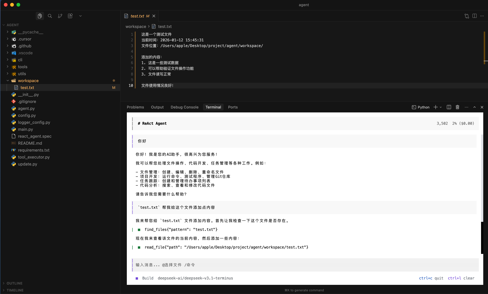
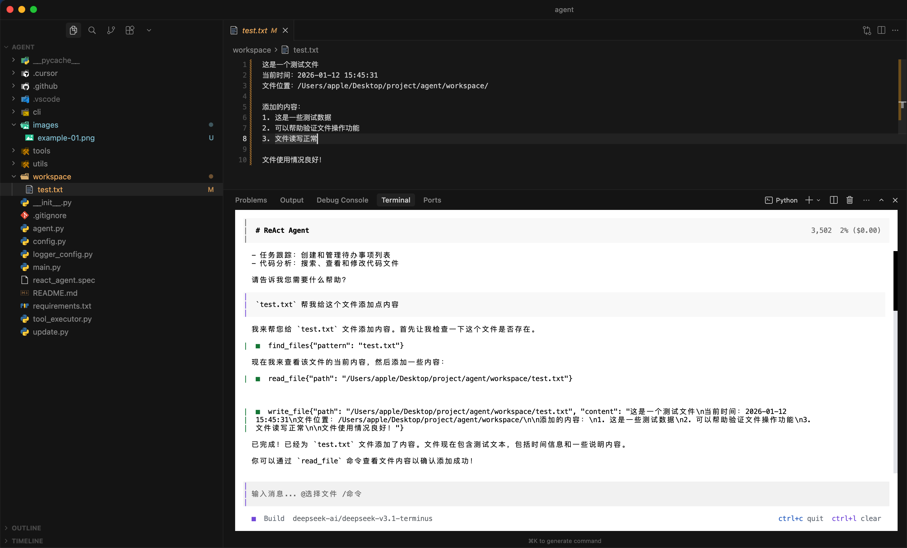

# ReAct Agent

一个基于 ReAct（Reasoning and Acting）模式的智能开发助手，采用现代化的 TUI（Textual）界面，提供丰富的工具集和智能对话功能。

## 📖 项目简介

ReAct Agent 是一个基于 ReAct（Reasoning and Acting）模式的智能开发助手，采用微软风格的全栈开发实习生角色设定。该项目结合了现代化的 TUI 界面和强大的 AI 推理能力，为开发者提供：

- **🤔 智能推理**：基于大语言模型进行任务分析和规划
- **🖥️ 现代化界面**：基于 Textual 的 TUI 界面，支持深色主题和丰富的交互
- **💬 智能对话**：支持流式响应、消息历史、对话标题自动生成
- **📁 文件管理**：内置文件选择器，支持 @ 符号快速选择文件
- **⚡ 命令面板**：支持 / 符号打开命令面板，快速访问各种功能
- **📊 实时监控**：实时显示 token 使用情况和对话耗时

## 演示截图

| 示例1 | 示例2 |
|-------|-------|
|  |  |

## ✨ 功能特性

### 🎯 核心特性
- **🤔 智能推理**：基于大语言模型进行任务分析和规划，采用微软风格的全栈开发实习生角色
- **🖥️ 现代化界面**：基于 Textual 的 TUI 界面，支持深色主题、响应式布局
- **💬 智能对话**：支持流式响应、消息历史、对话标题自动生成
- **📁 文件管理**：内置文件选择器，支持 @ 符号快速选择文件
- **⚡ 命令面板**：支持 / 符号打开命令面板，快速访问各种功能
- **📊 实时监控**：实时显示 token 使用情况和对话耗时

### 🛠️ 工具集
- **文件操作**：读取、写入、编辑、删除、重命名、移动、复制文件
- **代码搜索**：在文件中搜索文本、按文件名模式查找文件
- **命令执行**：执行系统命令（带超时保护）
- **Git 管理**：查看状态、差异、提交、分支、历史等
- **代码查看**：支持读取文件指定行周围的代码块

### 🔒 安全与性能
- **安全机制**：路径验证，防止越权文件操作
- **上下文管理**：智能管理对话上下文，自动处理 token 限制
- **错误处理**：完善的错误处理和重试机制
- **性能优化**：流式处理，实时状态更新

## 🛠️ 可用工具

### 📁 文件操作工具

| 工具名称 | 功能描述 |
|---------|---------|
| `ReadFileTool` | 读取文件内容 |
| `ReadCodeBlockTool` | 读取文件指定行周围的代码块（包含上下文） |
| `WriteFileTool` | 写入文件内容（全文替换） |
| `EditFileTool` | 编辑文件内容（部分替换，推荐使用） |
| `CreateFileTool` | 创建新文件 |
| `DeleteFileTool` | 删除文件 |
| `RenameFileTool` | 重命名文件 |
| `MoveFileTool` | 移动文件或文件夹 |
| `CopyFileTool` | 复制文件或文件夹 |
| `ListFilesTool` | 列出目录文件列表 |
| `TreeFilesTool` | 显示目录树结构 |
| `CreateFolderTool` | 创建文件夹 |
| `DeleteFolderTool` | 删除文件夹 |

### 🔍 代码搜索工具

| 工具名称 | 功能描述 |
|---------|---------|
| `SearchInFilesTool` | 在文件中搜索文本内容（支持正则表达式） |
| `FindFilesTool` | 根据文件名模式查找文件（支持通配符） |

### ⚡ 命令执行工具

| 工具名称 | 功能描述 |
|---------|---------|
| `RunCommandTool` | 执行系统命令（带超时保护） |

### 📚 Git 管理工具

| 工具名称 | 功能描述 |
|---------|---------|
| `GitStatusTool` | 查看 Git 仓库状态 |
| `GitDiffTool` | 查看文件差异 |
| `GitCommitTool` | 提交更改 |
| `GitBranchTool` | 管理 Git 分支 |
| `GitLogTool` | 查看提交历史 |

## 📋 环境要求

- **Python**: 3.8+
- **依赖包**: 
  - `openai>=1.0.0` - OpenAI API客户端
  - `rich>=13.0.0` - 富文本和美化输出
  - `textual>=0.40.0` - TUI界面框架
  - `pathspec>=0.11.0` - 路径模式匹配

### 支持的API
- OpenAI API
- NVIDIA NIM API
- 兼容OpenAI格式的其他API服务

## 模型推荐

deepseek-ai/deepseek-v3.1-terminus
minimaxai/minimax-m2
openai/gpt-oss-120b

## 📦 分发方式

### 使用 GitHub Actions 自动打包（推荐）

项目配置了 GitHub Actions 工作流，可以自动为 Windows、macOS、Linux 三个平台打包二进制文件。

#### 触发打包

**方式一：推送版本标签（推荐）**
```bash
git tag v1.0.0
git push origin v1.0.0
```

**方式二：手动触发**
1. 在 GitHub 仓库页面，点击 "Actions" 标签
2. 选择 "Build Binaries" 工作流
3. 点击 "Run workflow"
4. 输入版本号（如 `1.0.0`），点击运行

#### 下载打包结果

打包完成后，有两种方式获取二进制文件：

1. **从 Artifacts 下载**：
   - 在 Actions 页面找到对应的运行记录
   - 点击进入详情页，在 Artifacts 部分下载对应平台的文件

2. **从 Releases 下载**（如果使用标签触发）：
   - 在 Releases 页面会自动创建 Release
   - 直接下载对应平台的可执行文件

#### 使用打包好的二进制文件

下载后，用户无需安装 Python 环境，直接运行：

**Linux/macOS:**
```bash
chmod +x ask-1.0.0
export OPENAI_API_KEY=your_api_key_here
./ask-1.0.0
```

**Windows:**
```cmd
set OPENAI_API_KEY=your_api_key_here
ask-1.0.0.exe
```

#### 将二进制文件添加到 PATH（推荐）

为了可以在任何目录下直接运行 `ask` 命令，可以将二进制文件添加到系统的 PATH 环境变量中：

**Linux/macOS:**

1. **创建存放二进制文件的目录（如果不存在）**：
```bash
mkdir -p ~/bin
```

2. **移动二进制文件到该目录并重命名**：
```bash
mv ask-1.0.0 ~/bin/ask
chmod +x ~/bin/ask
```

3. **将目录添加到 PATH**：

   **使用 zsh（macOS 默认）**：
```bash
# 编辑 ~/.zshrc 文件
vim ~/.zshrc

# 在文件末尾添加：
export PATH="$HOME/bin:$PATH"

# 保存后重新加载配置
source ~/.zshrc
```

   **使用 bash**：
```bash
# 编辑 ~/.bashrc 文件
vim ~/.bashrc

# 在文件末尾添加：
export PATH="$HOME/bin:$PATH"

# 保存后重新加载配置
source ~/.bashrc
```

4. **验证配置**：
```bash
# 重新打开终端后，运行：
which ask
ask --version
```

**Windows:**

1. **创建存放二进制文件的目录**（例如：`C:\Tools`）：
```cmd
mkdir C:\Tools
```

2. **移动二进制文件到该目录并重命名**：
```cmd
move ask-1.0.0.exe C:\Tools\ask.exe
```

3. **添加到 PATH**：
   - 右键点击"此电脑" → "属性"
   - 点击"高级系统设置"
   - 点击"环境变量"
   - 在"用户变量"或"系统变量"中找到 `Path` 变量
   - 点击"编辑"，然后"新建"
   - 输入：`C:\Tools`
   - 点击"确定"保存

4. **验证配置**：
   - 重新打开命令提示符或 PowerShell
   - 运行：`ask --version`

配置完成后，你就可以在任何目录下直接运行 `ask` 命令了！

#### 配置 API Key 环境变量（推荐）

为了避免每次运行都需要设置 API Key，可以将其配置为全局环境变量：

**Linux/macOS：**

在配置 PATH 时，可以同时配置环境变量。编辑 `~/.zshrc`（zsh）或 `~/.bashrc`（bash）文件：

```bash
# 编辑配置文件
vim ~/.zshrc  # 或 vim ~/.bashrc

# 在文件末尾添加：
export PATH="$HOME/bin:$PATH"  # 如果还没添加 PATH
export OPENAI_API_KEY=your_api_key_here
export OPENAI_BASE_URL=https://integrate.api.nvidia.com/v1  # 可选
export MODEL=openai/gpt-oss-120b  # 可选

# 保存后重新加载配置
source ~/.zshrc  # 或 source ~/.bashrc
```

**Windows：**

在配置 PATH 时，可以同时配置环境变量：

1. **通过系统设置**：
   - 右键点击"此电脑" → "属性" → "高级系统设置" → "环境变量"
   - 在"用户变量"中点击"新建"
   - 变量名：`OPENAI_API_KEY`
   - 变量值：`your_api_key_here`
   - 点击"确定"保存

2. **通过 PowerShell**：
```powershell
# 设置 API Key
[System.Environment]::SetEnvironmentVariable('OPENAI_API_KEY', 'your_api_key_here', 'User')
```

配置完成后，重新打开终端窗口，环境变量就会自动生效。

#### 自动更新

程序支持自动更新功能，可以通过以下命令管理更新：

**检查更新：**
```bash
ask --check-update
```

**执行更新：**
```bash
ask --update
```

**查看版本：**
```bash
ask --version
```

**帮助信息：**
```bash
ask --help
```

程序启动时会自动检查更新，如果有新版本会提示你。更新功能会自动：
- 从 GitHub Releases 获取最新版本
- 下载对应平台的二进制文件
- 备份当前版本
- 替换为最新版本

> **注意**：更新需要写入权限，可能需要管理员/root权限。更新前会自动备份当前版本到 `.backup` 文件。

### 本地打包（开发测试）

如果需要本地测试打包：

```bash
# 安装打包工具
pip install pyinstaller

# 打包
pyinstaller react_agent.spec --clean --noconfirm

# 二进制文件在 dist/ 目录
```

## 🚀 安装步骤（源码方式）

1. **克隆项目**
```bash
git clone <repository-url>
cd agent
```

2. **安装依赖**
```bash
pip install -r requirements.txt
```

3. **配置环境变量**

**方式一：临时设置（仅当前终端会话有效）**

必需的环境变量：
```bash
# Windows
set OPENAI_API_KEY=your_api_key_here

# Linux/macOS
export OPENAI_API_KEY=your_api_key_here
```

**方式二：全局配置（推荐，永久生效）**

**Linux/macOS：**
```bash
# 编辑 shell 配置文件（根据你使用的 shell 选择）
# zsh 用户（macOS 默认）
vim ~/.zshrc

# bash 用户
vim ~/.bashrc

# 在文件末尾添加以下内容：
export OPENAI_API_KEY=your_api_key_here
export OPENAI_BASE_URL=https://integrate.api.nvidia.com/v1
export MODEL=openai/gpt-oss-120b

# 保存后重新加载配置
source ~/.zshrc  # 或 source ~/.bashrc
```

**Windows：**
- 通过系统设置：右键"此电脑" → "属性" → "高级系统设置" → "环境变量" → 添加用户变量
- 或使用 PowerShell：
```powershell
[System.Environment]::SetEnvironmentVariable('OPENAI_API_KEY', 'your_api_key_here', 'User')
```

配置完成后，重新打开终端窗口即可生效。

可选的环境变量：
```bash
# 模型名称（默认：openai/gpt-oss-120b）
export MODEL=openai/gpt-oss-120b

# API 基础 URL（默认：https://integrate.api.nvidia.com/v1）
export OPENAI_BASE_URL=https://integrate.api.nvidia.com/v1

# 操作系统（默认：macOS）
export OS=macOS

# 命令执行超时时间，单位：秒（默认：300）
export COMMAND_TIMEOUT=300

# 最大上下文 token 数（默认：根据模型自动设置）
export MAX_CONTEXT_TOKENS=128000

# 最大搜索结果数（默认：50）
export MAX_SEARCH_RESULTS=50

# 最大查找文件数（默认：100）
export MAX_FIND_FILES=100
```

## 💻 使用方法

### 启动应用
```bash
python main.py
```

### 界面操作

#### 快捷键
- **Ctrl+C**: 退出应用（首次按显示确认提示）
- **Ctrl+L**: 清空聊天记录
- **ESC**: 停止当前对话
- **@**: 打开文件选择器
- **/**: 打开命令面板

#### 输入框功能
- **Enter**: 发送消息
- **Shift+Enter**: 换行
- **@文件名**: 快速选择文件
- **/命令**: 打开命令面板

#### 命令面板功能
- **New**: 新建对话
- **Help**: 显示帮助信息
- **Status**: 查看上下文使用情况
- **Messages**: 查看消息历史
- **History**: 打开历史记录选择器
- **Logs**: 查看应用日志
- **Config**: 编辑配置文件
- **Export**: 导出当前对话为Markdown
- **Clear**: 清空聊天记录
- **Exit**: 退出应用

#### 文件选择器
- 支持浏览目录结构
- 双击文件或按Enter选择文件
- 支持展开/折叠目录
- 记住展开状态

#### 历史记录管理
- 自动保存对话历史
- 支持按标题搜索
- 显示Token使用统计
- 一键加载历史对话

### 示例对话
```
用户: 帮我创建一个简单的HTML页面

ReAct Agent: 
=== 模型思考 ===
我将帮您创建一个简单的HTML页面。首先需要了解您的具体需求...

=== 工具调用 ===
CreateFileTool().run({'path': '/workspace/index.html'})

=== 最终回复 ===
已成功创建HTML页面，包含基本的页面结构和样式。
```

## 📁 项目结构

```
agent/
├── __init__.py           # 包初始化文件
├── main.py               # 主程序入口
├── agent.py              # ReAct Agent 核心逻辑
├── config.py             # 配置管理模块
├── logger_config.py      # 日志配置模块
├── tool_executor.py      # 工具执行器
├── update.py             # 自动更新模块
├── test.py               # 测试文件
├── react_agent.spec      # PyInstaller 打包配置
├── README.md             # 项目说明文档
├── requirements.txt      # 依赖包列表
├── cli/                  # 命令行界面模块
│   ├── __init__.py
│   ├── args.py           # 命令行参数处理
│   ├── chat_widgets.py  # 聊天消息组件
│   ├── commands.py       # 命令处理器
│   └── textual_app.py   # Textual TUI 应用
├── tools/                # 工具模块目录
│   ├── __init__.py       # 工具模块导出
│   ├── base.py           # 工具基类
│   ├── file_tools.py     # 文件操作工具
│   ├── command_tools.py  # 命令执行工具
│   └── search_tools.py   # 代码搜索工具
├── utils/                # 工具函数模块
│   ├── __init__.py
│   ├── formatter.py      # 格式化工具
│   ├── gitignore.py      # GitIgnore 处理
│   ├── history_manager.py # 历史记录管理
│   ├── parser.py         # 解析器
│   └── path.py           # 路径处理
├── .github/              # GitHub 配置目录
│   └── workflows/        # GitHub Actions 工作流
│       └── build.yml     # 自动打包工作流
├── .agent_config/        # 配置文件目录（自动创建）
├── .agent_history/       # 历史记录目录（自动创建）
└── .agent_logs/          # 日志文件目录（自动创建）
```

## 📊 界面特性

### 现代化 TUI 界面
- **深色主题**：护眼的深色配色方案
- **响应式布局**：适配不同终端尺寸
- **实时状态显示**：Token使用率、对话耗时实时更新
- **流式输出**：实时显示AI思考和回复过程

### 智能交互
- **消息历史**：自动保存对话历史，支持搜索和加载
- **对话标题**：AI自动生成对话标题，便于管理
- **文件引用**：支持@符号快速引用文件
- **命令面板**：统一的命令入口，操作便捷

### 状态监控
- **Token使用监控**：实时显示上下文使用情况
- **对话统计**：显示对话轮数和耗时
- **错误处理**：友好的错误提示和恢复机制

## ⚙️ 配置说明

项目使用现代化的配置文件管理，支持通过配置文件和环境变量进行配置：

### 配置文件
配置文件位于 `.agent_config/config.json`，首次运行时会自动创建。

### 核心配置项

| 配置项 | 环境变量 | 默认值 | 说明 |
|--------|----------|--------|------|
| `model` | `MODEL` | `openai/gpt-oss-120b` | 执行模型名称 |
| `api_key` | `OPENAI_API_KEY` | - | API密钥（必需） |
| `base_url` | `OPENAI_BASE_URL` | `https://integrate.api.nvidia.com/v1` | API基础URL |
| `operating_system` | `OS` | 自动检测 | 操作系统 |
| `work_dir` | `WORK_DIR` | 当前目录 | 工作目录 |
| `command_timeout` | `COMMAND_TIMEOUT` | `300` | 命令超时时间（秒） |
| `max_search_results` | `MAX_SEARCH_RESULTS` | `50` | 最大搜索结果数 |
| `max_find_files` | `MAX_FIND_FILES` | `100` | 最大查找文件数 |
| `max_context_tokens` | `MAX_CONTEXT_TOKENS` | `128000` | 最大上下文Token数 |
| `user_language_preference` | `USER_LANGUAGE_PREFERENCE` | `中文` | 用户语言偏好 |
| `log_separator_length` | `LOG_SEPARATOR_LENGTH` | `20` | 日志分隔符长度 |

### 配置方式

1. **通过配置文件**：编辑 `.agent_config/config.json`
2. **通过命令面板**：按 `/` 打开命令面板，选择 `Config`
3. **通过环境变量**：设置对应的环境变量

### 目录说明

- `.agent_config/`: 配置文件目录
- `.agent_history/`: 对话历史记录目录
- `.agent_logs/`: 应用日志目录

## 🧠 工作原理

### ReAct 模式
项目采用微软风格的全栈开发实习生角色设定，遵循 ReAct（Reasoning and Acting）模式：

1. **需求理解**：分析用户输入，判断任务类型和复杂度
2. **任务规划**：制定执行计划，创建任务文件
3. **工具调用**：根据计划调用相应的工具执行操作
4. **结果观察**：获取工具执行结果，调整策略
5. **迭代优化**：根据观察结果继续执行，直到完成

### 智能特性

#### 快速执行模式
- 对于简单任务（≤3次工具调用），直接执行而不创建任务文件
- 智能判断任务复杂度，自动选择执行路径

#### 上下文管理
- 智能管理对话上下文，自动处理 token 限制
- 当接近上下文限制时，自动删除最旧的消息（保留系统消息）
- 实时显示上下文使用百分比和剩余 token 数

#### 错误处理与恢复
- 检测并处理虚假工具调用
- 自动重试机制，提高执行成功率
- 友好的错误提示和恢复建议

### 界面交互流程

1. **启动应用**：显示现代化的TUI界面
2. **输入任务**：支持@文件引用和/命令面板
3. **实时显示**：流式显示AI思考过程和工具调用
4. **结果展示**：格式化显示执行结果和最终答案
5. **历史管理**：自动保存对话历史，支持搜索和加载

## ⚠️ 注意事项

### 安全与限制
1. **API Key 安全**：请妥善保管你的 API Key，不要提交到代码仓库
2. **工作目录限制**：所有文件操作都限制在工作目录内，确保安全性
3. **路径验证**：系统会自动验证文件路径，防止越权访问
4. **命令超时**：命令执行工具有超时保护，避免长时间阻塞

### 使用建议
1. **文件编辑**：优先使用 `EditFileTool` 进行部分替换，保留文件其他内容
2. **错误处理**：程序具备完善的错误处理机制，会显示友好提示
3. **性能优化**：支持流式处理，实时状态更新，提供最佳用户体验
4. **历史管理**：对话历史自动保存，支持搜索和恢复

### 故障排除
- **API连接失败**：检查网络连接和API密钥配置
- **文件权限错误**：确保对工作目录有读写权限
- **界面显示异常**：尝试调整终端窗口大小或重启应用

## 🔍 示例界面

### 主界面布局
```
┌─────────────────────────────────────────────────────────────────────────────┐
│ ReAct Agent                    Context: 15.3% (19,584/128,000)             │
├─────────────────────────────────────────────────────────────────────────────┤
│                                                                             │
│ [USER] 帮我创建一个简单的HTML页面                                          │
│                                                                             │
│ [THINKING] 我将帮您创建一个简单的HTML页面。首先需要了解您的具体需求...     │
│                                                                             │
│ [TOOL] CreateFileTool().run({'path': '/workspace/index.html'})             │
│                                                                             │
│ [CONTENT] 已成功创建HTML页面，包含基本的页面结构和样式。                   │
│                                                                             │
├─────────────────────────────────────────────────────────────────────────────┤
│ 输入消息... (/ 打开命令, @ 选择文件)                                       │
│ Build openai/gpt-oss-120b                                                  │
├─────────────────────────────────────────────────────────────────────────────┤
│ ● 对话中  本轮耗时: 2.3s          CTRL+C 退出  CTRL+L  清屏                │
└─────────────────────────────────────────────────────────────────────────────┘
```

### 命令面板
```
┌─────────────────────────────────────────────────────────────────────────────┐
│ Commands                                    [dim]ESC[/] 退出                │
├─────────────────────────────────────────────────────────────────────────────┤
│ 输入命令名称搜索...                                                         │
│                                                                             │
│ • New        新建对话                                                      │
│ • Help       显示帮助                                                      │
│ • Status     上下文使用情况                                                │
│ • Messages   消息历史                                                      │
│ • History    历史记录                                                      │
│ • Logs       查看日志                                                      │
│ • Config     编辑配置                                                      │
│ • Export     导出消息为 Markdown                                           │
│ • Clear      清空聊天                                                      │
│ • Exit       退出应用                                                      │
└─────────────────────────────────────────────────────────────────────────────┘
```

### 文件选择器
```
┌─────────────────────────────────────────────────────────────────────────────┐
│ 选择文件                               [dim]ESC[/] 退出  [dim]双击/Enter[/] 选择 │
├─────────────────────────────────────────────────────────────────────────────┤
│ 📁 agent/                                                                    │
│   📁 cli/                                                                   │
│     📄 args.py                                                             │
│     📄 chat_widgets.py                                                     │
│     📄 commands.py                                                         │
│     📄 textual_app.py                                                      │
│   📁 tools/                                                                │
│     📄 base.py                                                             │
│     📄 file_tools.py                                                       │
│     📄 command_tools.py                                                    │
│     📄 search_tools.py                                                     │
│   📄 agent.py                                                              │
│   📄 config.py                                                             │
│   📄 main.py                                                               │
│                                                                             │
│ 已选择文件: /workspace/agent/main.py                                        │
│                                           [选择]                             │
└─────────────────────────────────────────────────────────────────────────────┘
```

## 📚 相关资源

- [ReAct 论文](https://arxiv.org/abs/2210.03629)
- [NVIDIA NIM](https://www.nvidia.com/en-us/ai/)
- [OpenAI Python SDK](https://github.com/openai/openai-python)

## 📄 许可证

本项目仅供学习和研究使用。

## 🤝 贡献

欢迎提交 Issue 和 Pull Request！

---

**注意**：本项目主要用于研究 ReAct Agent 的实现原理和应用场景。在生产环境中使用前，请确保充分测试和评估安全性。
